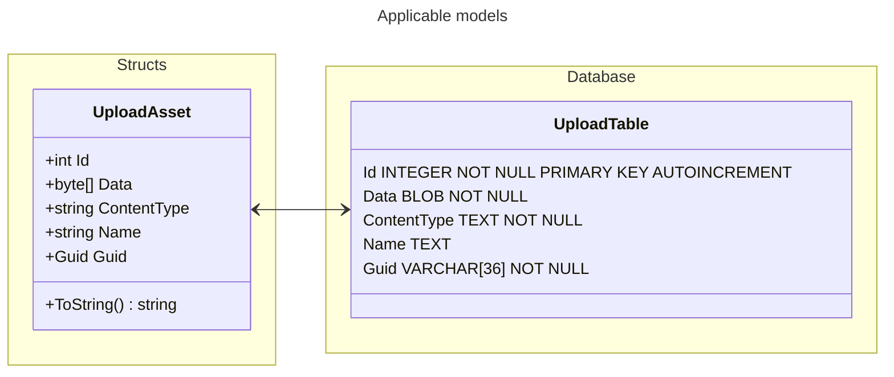

# Kodehode backend - C# rest API - group project - solo

## Structure
static content lives under and is served from `wwwroot`

### Static resources
**Endpoint** `/<name>` where `<name>` is the filename of the resource under `wwwroot`

### API
Documentation conforming to OpenAPI spec is generated from source code, and is accessible through a web ui at `/swagger`

**API** endpoints are grouped under `/api` and versioned by subpath `v<int>`.
Supported versions: `v1`
as such all endpoints live under `/api/v1` currently.

### Rationale
grouping endpoints under a versioned path allows graceful expansion, transition, and deprecation of the API over time.

## Models

## N.B
This document was generated from [this template document](./README.template.md).